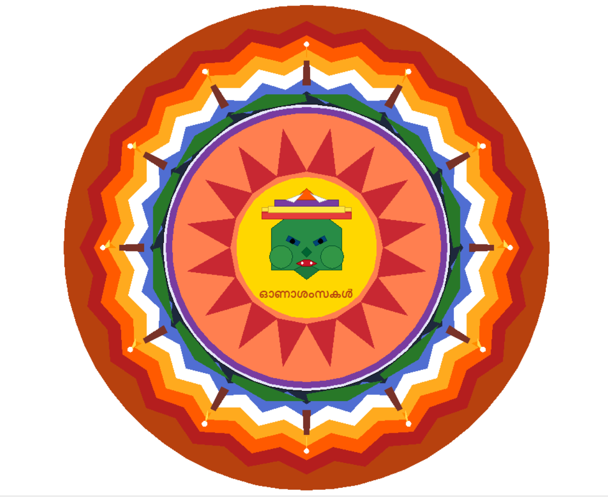

# 🌸 Kathakalam - Onam Kathakali Pookkalam

This project generates a traditional **Onam Pookkalam (flower carpet)** pattern using Python and Matplotlib.  
It combines math, geometry, and cultural art to create a vibrant traditional design programmatically. The design features a minimalistic Kathakali face in the centre along with a "Happy Onam" text in Malayalam.

---

## 📸 Preview
Here’s an example of the generated design:



---

## 🚀 Run it yourself
You can open and run the notebook directly in Google Colab, no setup required:

[](https://colab.research.google.com/github/n4kulcodes/code-a-pookkalam/blob/main/notebooks/CodeAPookkalam.ipynb)

---

## 📂 Project Structure
- `CodeAPookkalam.ipynb` → Main notebook (works in Google Colab/Jupyter).
- `KathakaliPookkalam.png` → Example output screenshot.
- `README.md` → Project description and instructions.
-  `KathakaliPookkalam.py` → Turtle based version (works locally).

*(Optional)*  
- `pookkalam_turtle.py` → Turtle Graphics version for local execution (may not render properly in online IDEs).

---

## 📝 Description
The Pookkalam Generator is a creative coding project inspired by the floral carpets made during the festival of **Onam** in Kerala, India.  
It uses:
- **Matplotlib** for drawing geometric, symmetrical floral patterns.
- Randomized color choices for variety.
- Parametric shapes (circles, petals, layers) to simulate traditional designs.

This project demonstrates the blend of **art + math + code** and can be extended with:
- Custom color palettes
- Malayalam text rendering
- Pattern symmetry variations

---

## ⚡ Requirements
If you want to run locally:
```bash
pip install matplotlib numpy
